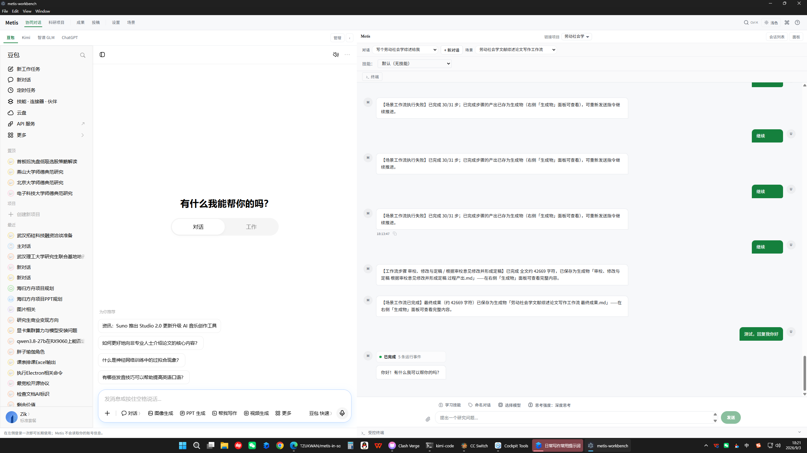
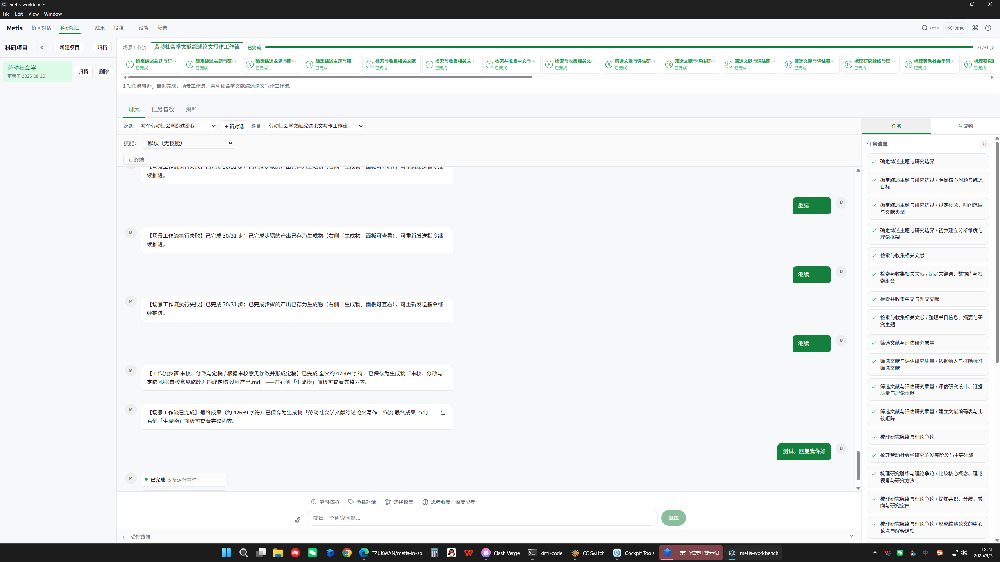
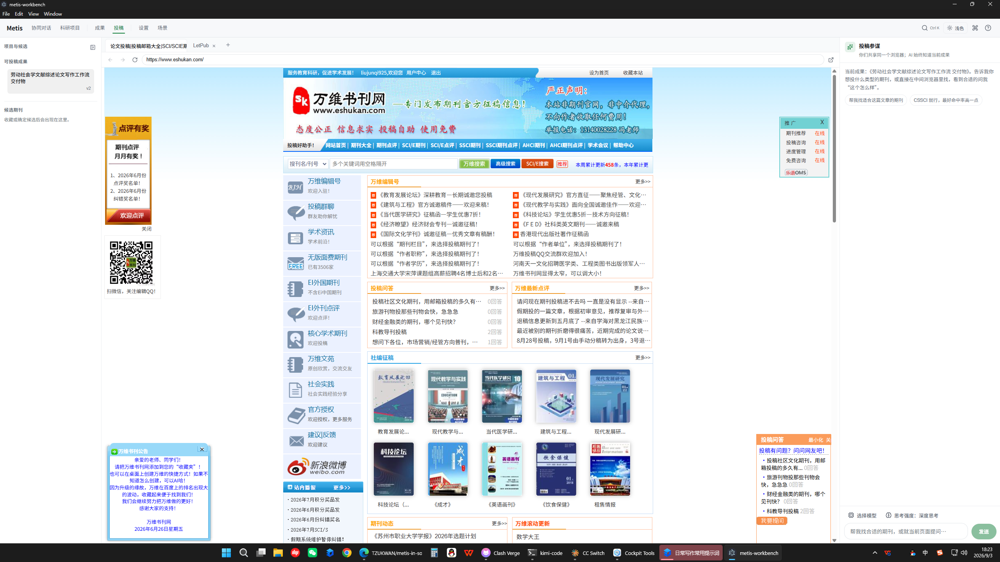
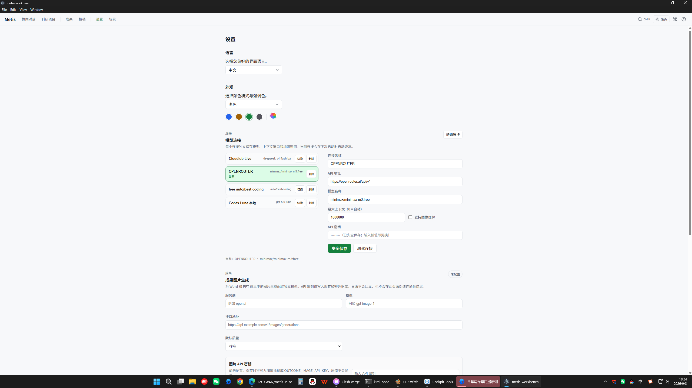

<div align="center">

# 📖 Metis Research Workbench

# 本地优先的 AI-Native 科研工作台

**可执行场景 × 共享浏览器智能体 × 运行时强制的研究诚信**

为社会科学与一切以证据为基础的写作而生。
把 AI 对话、文献检索、可复现研究工作流、成果编辑、期刊选投与投稿辅助装进同一个桌面工作区——
并让**诚信成为由确定性代码计算的系统属性，而不是模型的自觉**。

[⬇️ 下载 v0.1.0-alpha.3](https://github.com/TZUKWAN/metis-in-social-science/releases/latest) ·
[🧩 个人化指南](docs/PERSONALIZATION_GUIDE.md) ·
[🏗️ 架构文档](docs/PERSONALIZATION_ARCHITECTURE.md) ·
[🐛 问题反馈](https://github.com/TZUKWAN/metis-in-social-science/issues)


</div>

---

## 📌 目录

- [Metis 是什么](#-metis-是什么)
- [为什么它不一样：五个领先性设计](#-为什么它不一样五个领先性设计)
- [界面一览](#-界面一览)
- [核心功能详解](#-核心功能详解)
  - [① 协同对话——多模型、可引导的 AI 主驾驶舱](#-协同对话多模型可引导的-ai-主驾驶舱)
  - [② 科研项目与可执行场景——把工作流编译成代码](#-科研项目与可执行场景把工作流编译成代码)
  - [③ 文献检索与文献库——中文社科文献的真实覆盖](#-文献检索与文献库中文社科文献的真实覆盖)
  - [④ 投稿工作区——共享浏览器的投稿参谋](#-投稿工作区共享浏览器的投稿参谋)
  - [⑤ 申报书（基金模板）——从模板解析到逐栏草稿](#-申报书基金模板从模板解析到逐栏草稿)
  - [⑥ 成果工作台——应用内 Office 与版本链](#-成果工作台应用内-office-与版本链)
  - [⑦ 微信 Bot——把整个工作台装进微信](#-微信-bot把整个工作台装进微信)
  - [⑧ 个人化中心——五类用户自有定义](#-个人化中心五类用户自有定义)
  - [⑨ 免费模型中心——供应商不可知](#-免费模型中心供应商不可知)
- [运行时强制的诚信管线](#-运行时强制的诚信管线)
- [技术架构](#️-技术架构)
- [安装](#-安装)
- [开发与构建](#️-开发与构建)
- [质量保障](#-质量保障)
- [路线图](#-路线图)

---

## 🤔 Metis 是什么

### 一个真实的痛点

社会科学研究者的日常被工具撕裂：对话在 ChatGPT、文献在知网、投稿在万维一个个点开看、
正文在 Word、投稿记录在 Excel。每换一个工具，上下文就断一次——AI 不知道你的论文写到哪一章，
文献管理软件不理解你的研究主题，投稿网站更不会替你记住"这本刊要求摘要不超过 300 字"。

**Metis 把这条完整链路装进一个本地桌面工作区，并让 AI 始终同时拥有三样东西：
你的成果全文、你正在看的真实网页、你的投稿意向。**

### 一个尖锐的诚信问题

通用 AI 助手会一本正经地编造参考文献、虚构影响因子、暗示"这篇论文已经过同行评审"。
在学术场景里，这些不是小毛病，是灾难。

### Metis 的回答

> **诚信不是提示词里的一句"请不要编造"，而是由确定性代码计算的运行时属性。**

- 每一篇进入文献库的文献都必须经过**真实性闸门**：DOI 经 Crossref 逐条核验、或携带可访问 URL，
  两者皆无的题录**直接拒收**，并在日志中留下拒收计数；
- 每一条 AI 声称的投稿要求都必须附带**原文逐字证据**，核验不过整条丢弃；
- 每一次不可逆操作（正式提交稿件、删除成果、支付费用）都被**结构化确认卡**拦截；
- 每一次发布的安装包都携带**fail-closed 的构建溯源**——仓库不干净、提交与远端不一致时拒绝出包。

这是 Metis 与"套壳聊天助手"最本质的区别。

---

## 🚀 为什么它不一样：五个领先性设计

### 1️⃣ 共享浏览器智能体（Shared Browser Agent）——AI 与你看同一个网页

投稿工作区的中间是一块**真实的浏览器**（万维、LetPub、期刊官网、ScholarOne、Editorial Manager）。
关键在于：**AI 操作的就是你眼前这个浏览器视图，不是后台偷偷另开的自动化会话。**

你说"这个期刊怎么样"，AI 直接读取你正在看的页面；你说"看看它最近发过类似的吗"，
AI 当着你的面翻近期目录。没有上下文错位，没有"AI 说的页面我找不到"。

### 2️⃣ 可执行场景（Executable Scenarios）——工作流即代码

把"写一篇文献综述"的完整方法学（拆题 → 检索策略 → 文献收集 → 质量评估 → 论辩地图 →
章节规划 → 定稿）描述给 AI，由**场景编译器**编译成一个 31 步的可执行工作流：
每一步有目标、完成标准、工具绑定、重试策略与完整性摘要（digest）。
执行支持断点恢复、步骤引导、跳过与分支重做——**工作流成为可审计的代码资产，而不是一段聊天记录**。

### 3️⃣ 中文社科文献的真实覆盖——NCPSSD + LetPub + 万维三源

通用 AI 助手对中文社科期刊几乎失明。Metis 内建三个真实中文源：

| 来源 | 覆盖 | Metis 拿到什么 |
|---|---|---|
| **NCPSSD** 国家哲学社会科学文献中心 | 35 万+ 中文论文 | 题录、核心期刊标记（CSSCI/北大核心）、全文链接 |
| **万维书刊** | 数千种中文期刊 | 投稿方式（官网/邮箱/知网系统）、征稿启事、版面费与审稿经验点评 |
| **LetPub** | SCI/SSCI 国际期刊 | 领域树、影响因子、中科院分区、预警名单、**官方投稿网址**（破解 base64 点击统计还原真实 URL） |

### 4️⃣ 运行时诚信管线——证据纪律由代码执行

反幻觉不是一句提示词：**逐字证据核验**（AI 声称的每条规则必须在原文中逐字存在）、
**真实性闸门**（无 DOI 无 URL 的文献拒收）、**结构化确认卡**（不可逆操作人工拍板）、
**沙箱文件能力**（模型触碰文件必须经过一次性能力凭证）。

### 5️⃣ 供应商不可知 + 本地优先

OpenAI 兼容协议任意接入（Cloudlobe、OpenRouter、本地 Ollama/vLLM/LaTeX 套件均实测可用），
一个对话里随时切换模型与思考强度。全部数据存于本地 SQLite，发布包带
SBOM 与 fail-closed 构建溯源。**你的研究数据只属于你。**

---

## 📸 界面一览

### 🤝 协同对话——多模型 AI 主驾驶舱

会话按项目分组；流式输出带推理过程折叠；斜杠命令、学习技能、一键命名对话；
对话可直接引导正在执行的场景。下方工具条提供**选择模型 / 思考强度**快速切换。



### 🧭 科研项目工作台——研究的家

项目、目标、研究资料、场景运行全部以项目为轴组织。



### 🎬 场景工作台——对话构建，右侧同步成型

左侧场景库（可分类、回收站、配置包导入导出）；中栏场景定义逐节编辑；
右侧**场景配置助手**通过对话把需求直接写入交付物结构与连续 Workflow。


### 📝 成果工作台——应用内 Word 编辑与 AI 协作

块级 Word 编辑器：分页预览、跨段/跨页自由选中、选区 AI 改写（保留/放弃确认）、
引文插入、排版模板（支持**导入外部 DOCX 模板读取其排版规则**）、版本链与恢复。
需要原生排版能力时一键进入 **Metis Office**（Ribbon 完整的原生编辑套件），
保存并关闭后自动同步回 METIS 生成新版本。


### 🏛️ 投稿工作区——共享浏览器的投稿参谋 ★

三栏工作区：左栏成果与候选期刊短名单；中栏**真实浏览器**（万维 / LetPub 双标签起步，
可自由导航新开）；右栏**投稿参谋**——它同时拥有你的成果全文、你正在看的网页、你的投稿意向。
说"帮我找合适的期刊"，它先用结构化卡片确认渠道偏好（CSSCI / 北大核心 / SCI / SSCI…），
再当着你的面在真实目录里检索、核实，以候选期刊卡给出**契合点 / 风险 / 修改建议**；
说"就投这个"，自动创建正式投稿记录并进入投稿准备。



### ⚙️ 模型连接——供应商不可知

任意 OpenAI 兼容端点即插即用；连接独立保存模型、上下文窗口与加密密钥；
支持测试连接、运行时热切换；成果图片生成可另配独立模型。



---

## 🧩 核心功能详解

### ① 协同对话——多模型、可引导的 AI 主驾驶舱

- **多供应商多模型**：每个项目可绑定不同模型配置；对话中一键切换模型与
  思考强度（快速 / 标准 / 深度思考），思考强度真实注入本轮推理指令。
- **流式与推理可视化**：token 级流式渲染，模型的推理过程折叠展示，正在写什么一目了然。
- **会话即资产**：会话按项目持久化（SQLite），支持一键命名、历史检索；
  "学习技能"可把一段优质对话沉淀为可复用技能。
- **场景执行引导**：场景运行中，对话自动切换为**实时引导通道**——
  每条消息直接引导当前步骤，不打断运行状态。
- **斜杠命令与附件**：`/` 唤起命令菜单；拖入 PDF / DOCX 即成对话材料。

### ② 科研项目与可执行场景——把工作流编译成代码

这是 Metis 的心脏。传统 AI 对话帮你" brainstorm 一份提纲"，Metis 把完整研究方法学
**编译为可执行、可审计、可恢复的工作流**：

```text
你说：  "帮我做一篇劳动社会学的文献综述论文。"
        ↓  场景编译器（AI + 结构契约 + 能力绑定校验）
场景：  31 步工作流 —— 每步有 goal / 完成标准 / 工具绑定 / 重试策略 / integrity digest
        ↓  执行引擎
运行：  步骤逐步推进 → 检索类步骤自动挂载真实检索工具 → 产物落库 → 文献自动入库
```

- **AI 场景编译器**：自然语言一句话生成完整工作流；编译器强制"检索类步骤必须绑定
  真实检索能力"，未绑定的检索步骤在编译期即判无效。
- **步骤卡交互**：每个步骤完成后以卡片形式汇报"思路 / 结果 / 下一步"，
  你可以**引导**（追加指令重做本步）、**跳过**、或**分支重做**，全部带完整性摘要。
- **断点恢复**：运行状态与 manifest digest 绑定，应用重启、会话关闭后"继续"能精确接上；
  完整性校验不过的记录进入隔离区，可从可信历史版本恢复。
- **文献桥**：检索步骤的产物自动解析为结构化题录 → DOI 走 Crossref 核验 /
  URL 直收 → 写入 `papers / sources / paper_project_links` 三表 → 资料页立即可见。
  存量老场景无需重新编译，运行期自动获得检索工具注入。
- **产物双写**：交付包自动同步到成果页（Word 成果 + 生成物面板），研究产出不散落。

### ③ 文献检索与文献库——中文社科文献的真实覆盖

- **NCPSSD（国家哲学社会科学文献中心）**：中文期刊论文题录检索，默认限核心期刊，
  返回标题 / 作者 / 期刊 / 年份 / 摘要 / 全文链接。
- **Semantic Scholar + arXiv + Crossref + OpenAlex**：外文文献与元数据核验的全谱系覆盖。
- **真实性闸门**：所有入库文献三态处理——有 DOI 的逐条核验、有 URL 的直收、
  两者皆无的**拒收并计数**。文献库永远不会被编造的题录污染。
- **项目资料页**：文献按项目组织，支持全文检索（FTS）、标签、阅读状态、引用网络。

### ④ 投稿工作区——共享浏览器的投稿参谋

投稿从来不是"填个表"，而是一条完整决策链。Metis 用一个三栏工作区把它装下：

```text
┌──────────────┬──────────────────────────────┬──────────────────────┐
│ 项目 / 成果   │ Browser（真实网页）            │ 投稿参谋（AI）        │
│              │                              │                      │
│ 当前成果      │ 万维 / LetPub / 期刊官网       │ 成果全文上下文        │
│ 候选期刊短名单 │ 投稿须知 / 近期目录            │ 当前网页上下文        │
│              │ ScholarOne / 投稿系统         │ 投稿意向（结构化）    │
└──────────────┴──────────────────────────────┴──────────────────────┘
```

- **同一个浏览器会话**：AI 的浏览器操作（导航 / 读取）直接作用在你中栏看到的
  WebContentsView 上——AI 看到的就是你看到的，杜绝"后台偷偷开另一个浏览器"。
- **结构化意图捕获**：第一次说"帮我找期刊"，AI 不会乱搜——先以**可点选的选择卡**
  确认发表渠道（CSSCI / 北大核心 / CSCD / SSCI / SCI / 会议…，可多选），
  追问只问"无法从成果推断且显著影响推荐"的信息；你随时可以说
  "北核也可以""不考虑太贵的"，意向实时更新。
- **候选期刊卡**：每张卡带契合点 / 风险 / 标签 / 原文链接，
  结论用五档制（建议第一顺位投稿 → 当前版本不建议投稿），拒绝虚假的单一匹配度分数。
- **期刊详情核验**：LetPub 详情的官方网址与投稿网址以 base64 藏在点击统计参数里，
  Metis 解码还原真实 URL；万维详情解析出投稿邮箱 / 投稿系统 / 电话 / 征稿启事全文。
- **投稿要求 → 成果差距**：确定期刊后，AI 抓取并整理投稿要求
  （字数 / 摘要 / 关键词 / 匿名要求 / 参考文献 / 格式…），与当前成果逐条比对，
  给出"需要处理项"清单，可直接调用成果编辑能力修改。
- **Human-in-the-loop**：辅助填写投稿系统表单（字段级读取与填充），
  但**正式提交前必须出现确认卡**——提交、撤稿、版权协议、付费，永远由你按下按钮。
- **投稿记录后台化**：28 态生命周期由真实事件自动维护；你看到的只是
  "正在选刊 → 准备投稿 → 已提交 → 审稿中 → 返修 → 已完成"。

### ⑤ 申报书（基金模板）——从模板解析到逐栏草稿

- **模板解析引擎**：上传国家社科 / 教育部 / 省部级申报书（PDF 或 DOCX），
  解析出**章节树、每栏填写要求、限字数、表格结构**，全部带原文证据定位与置信度，
  存为可追溯的版本化档案（不保存申请人正文，不把本地路径交给模型）。
- **逐栏填写草稿**：粘贴你的研究材料，AI 按栏目结构逐栏生成填写草稿——
  材料没覆盖的栏目只给填写框架与"待补充"清单，**不编造事实、数字与经费**；
  一键导出 DOCX 对照填写。
- **版本差异核验**：申报书改版后，自动 diff 新旧模板的栏目与要求变化。

### ⑥ 成果工作台——应用内 Office 与版本链

- **四类成果**：Word（块级编辑器 + 分页预览）、PPT（模板 + 生成技能）、表格、PDF。
- **Metis Office 原生编辑**：一键在外置 GenOffice 套件中以原生 Ribbon 编辑，
  保存并关闭后**自动同步回 METIS** 创建新版本（进程存活监测 + 落盘重试），无需手动确认。
- **AI 局部编辑**：选中任意段落（支持跨段 / 跨页自由选中），改写 / 压缩 / 自定义指令，
  修改以新版本呈现，**保留或放弃由你决定**；对混合思考与 JSON 的模型输出做了鲁棒解析。
- **排版系统**：可视化排版面板（字体 / 字号 / 行距 / 首行缩进 / 页边距 / 页眉页脚 / 页码）、
  一句话排版指令（"宋体小四 1.5 倍行距"）、命名模板复用，
  以及**导入外部 DOCX 模板**自动读取其排版规则一键套排。
- **版本链**：每次保存 / AI 修改 / 外部同步都是带说明的版本，可随时回滚与对比。
- **导出**：DOCX 导出、预览栏即时导出、交付包打包。

### ⑦ 微信 Bot——把整个工作台装进微信

- 基于腾讯官方 **iLink 协议**扫码绑定（持久登录分区，重启不掉线）；
- 微信里直接与 METIS 对话：支持 `/项目` `/模型` `/状态` `/新建` `/继续` 等指令；
- 消息进入与桌面端相同的 Agent 会话，完成摘要自动回发；
- 扫码状态机完整处理过期刷新、配对验证码、IDC 重定向。

### ⑧ 个人化中心——五类用户自有定义

- **场景 / 技能 / 智能体 / 规则（Metis.md）/ MCP** 五类定义全部用户自有，
  支持分类、归档回收站、配置包导入导出（凭据不导出）。
- **内置技能**：文献综述、基金模板分析（只读 + 完整性绑定）、投稿参谋等随版本分发；
- **MCP 桥**：外部 MCP 服务器工具与内置工具走同一注册表与权限模型。

### ⑨ 免费模型中心——供应商不可知

- 预置免费/低价端点清单，一键接入；密钥加密存储于系统凭据库；
- 上下文窗口、图像理解能力等元数据可视化配置。

---

## 🛡️ 运行时强制的诚信管线

| 诚信威胁 | Metis 的运行时对策 |
|---|---|
| 模型编造参考文献 | 文献真实性闸门：DOI 经 Crossref 核验 / URL 直收 / 皆无拒收并计数 |
| 模型虚构投稿要求 | 逐字证据核验：声称的规则必须在抓取原文中逐字存在，否则整条丢弃 |
| 模型伪造期刊指标 | 目录工具只返回站点真实解析结果；提示词纪律禁止凭记忆给出 IF / 分区 |
| AI 静默修改文档 | 选区 AI 修改全部以"新版本 + 保留/放弃"呈现，可一键回滚 |
| 不可逆操作误触 | 提交 / 撤稿 / 删除 / 付费一律结构化确认卡 + 人工确认 |
| 模型越权触碰文件 | 文件能力一次性凭证（FileCapability），路径白名单 + 原子消费 |
| 不安全内容注入对话 | SafeMarkdown 白名单渲染、外链与本地路径拦截、诊断模式敏感信息脱敏 |
| 构建产物不可信 | 发布溯源 fail-closed：仓库不洁 / 提交与远端不一致拒绝出包，SBOM 随包 |

---

## 🏗️ 技术架构

```text
┌────────────────────────── Electron 桌面壳 ──────────────────────────┐
│  Renderer (React 19 + TypeScript strict)                            │
│  ├── 三栏 Submission Workspace    ├── 场景工作台 / 配置助手           │
│  ├── 成果工作台 (Word/PPT/表格/PDF) ├── 协同对话 (流式 + 推理可视化)   │
│  └── SafeMarkdown 消息围栏块（JournalCard / ChoiceGroup / StepCard）  │
├──────────────────────── Main Process（30+ 领域服务）─────────────────┤
│  ScenarioWorkflowService   场景编译/执行/完整性/文献桥                │
│  SubmissionAssistantService 投稿参谋（Artifact+Browser+Intent）      │
│  BrowserService            共享浏览器（WebContentsView + AI 控制面）  │
│  JournalProfileService     期刊身份核验 / 指南抓取 / 语料 / 范式      │
│  OutcomeAssistantService   成果协同（结构化编辑协议）                 │
│  FundingTemplateService    申报书观察 / 分析 / 版本仓                │
│  WeChatBotService          iLink 协议 / 扫码绑定 / 消息泵            │
│  LiteratureSearchService   NCPSSD + OpenAlex 双源                   │
├──────────────────────── engine（纯 TS 运行时，零 Electron 依赖）──────┤
│  AgentLoop / ToolRegistry / ToolDispatcher / HookBus                 │
│  JournalCatalog（LetPub + 万维解析器，Chromium 栈抓取 + 代理回退）     │
│  SubmissionRuntimeContract（28 态生命周期 + CAS + 事件溯源）          │
│  FundingTemplateAnalyzer（观察 → 归一化 → 字段映射 → 差异）           │
│  EvidenceLedger / 引用真实性 / 诊断契约                               │
├──────────────────────── 数据与集成 ─────────────────────────────────┤
│  SQLite（30+ 表，项目/成果/场景/投稿/会话/文献/模板/审计）             │
│  GenOffice 套件（DOCX/PPTX 引擎 + xlsx sidecar）                     │
│  MCP 服务器桥 / NCPSSD / LetPub / 万维 / Crossref / OpenAlex / arXiv │
└─────────────────────────────────────────────────────────────────────┘
```

**分层纪律**：`engine` 不依赖 Electron（纯 Node 运行时，测试全离线可跑）；
渲染层与主进程只经 IPC 契约（Zod 双向校验）通信；agent 工具统一注册于
`ToolRegistry`，输出经 per-tool 安全 decoder 过界。

---

## 📦 安装

### Windows 安装包（推荐）

前往 [Releases](https://github.com/TZUKWAN/metis-in-social-science/releases/latest) 下载：

- `Metis-Research-Workbench-Setup-x64.exe` —— NSIS 安装器（推荐）
- `Metis-Research-Workbench-x64.msi` —— 企业部署格式

### 首次启动四步

1. **连接模型**：设置 → 模型连接 → 新建连接（任意 OpenAI 兼容端点），安全保存并测试；
2. **建项目**：左上角创建你的研究项目；
3. **选场景**：进入「场景」新建或选择一个场景，用一句话让配置助手生成工作流；
4. **开始研究**：协同对话里发起任务；论文写完去「投稿」让参谋陪你选刊。

---

## 🛠️ 开发与构建

```bash
npm install                 # 安装依赖
npm run dev                 # 开发模式（Vite + Electron 热载）
npm run typecheck           # 四工程严格类型检查
npm run test:fast           # 全量测试（4,000+ 用例）
npm run build:electron      # 生产构建
npm run release:windows     # 发布链（溯源 → 构建 → NSIS+MSI → SBOM → 扫描 → 校验）
```

---

## ✅ 质量保障

- **4,000+ 自动化测试**：覆盖 engine 纯函数、Electron 服务、React 组件与安全契约；
- **四工程严格类型检查**：app / engine / node / electron 全部 `--strict` 通过；
- **fail-closed 发布链**：构建溯源（仓库清洁 + 提交与远端一致）→ SBOM + 许可证扫描
  → 安装包安全扫描 → 发布策略校验，任一环节失败即拒绝出包。

---

## 🗺️ 路线图

- [ ] 投稿参谋流式渲染与网页选区引用（选中网页文字直接问 AI）
- [ ] AI 判断反向定位网页证据（点击引用自动滚动高亮）
- [ ] 投稿系统表单辅助填写（ScholarOne / Editorial Manager / 国内系统）
- [ ] 场景市场：研究方法学工作流的分享与安装
- [ ] macOS 构建支持

---

## 📄 License

MIT —— 详见 [LICENSE](LICENSE)。

<div align="center">

**Metis：让 AI 成为可审计的研究合作者，而不是黑箱。**

</div>
