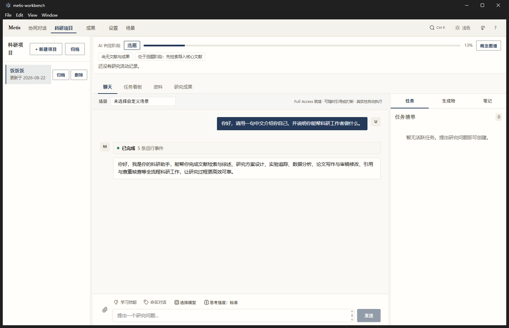
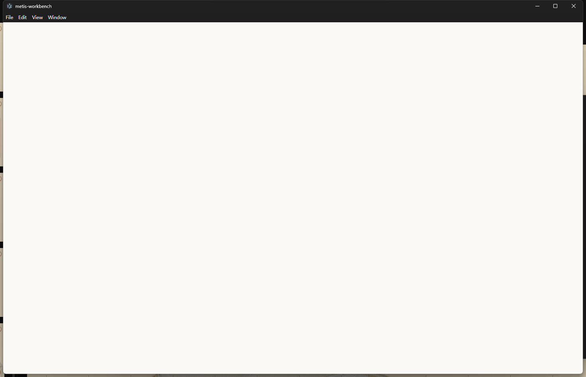
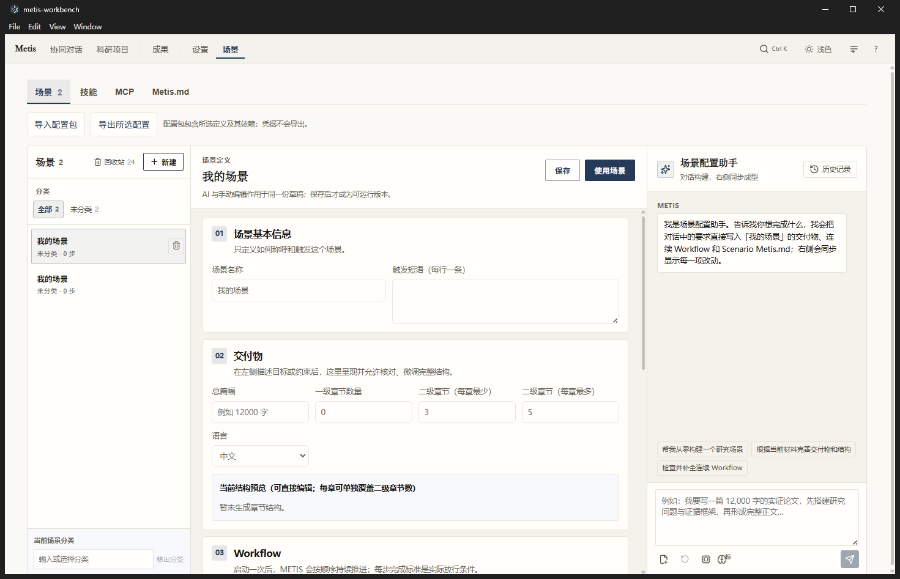
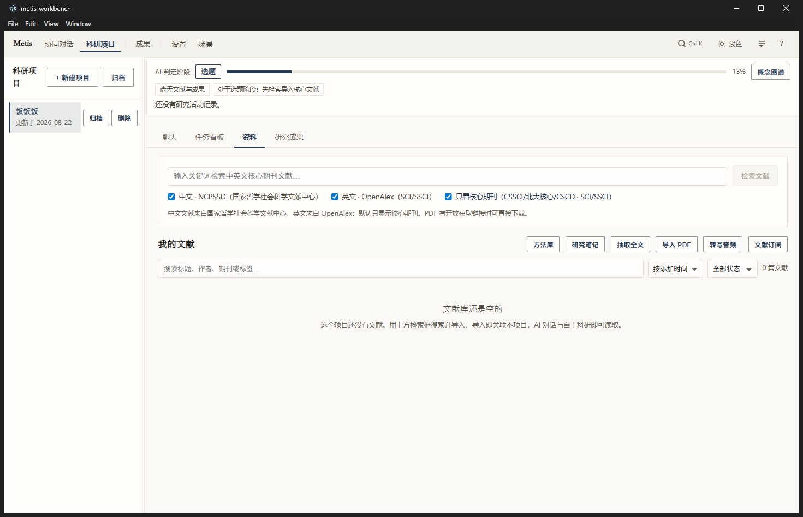
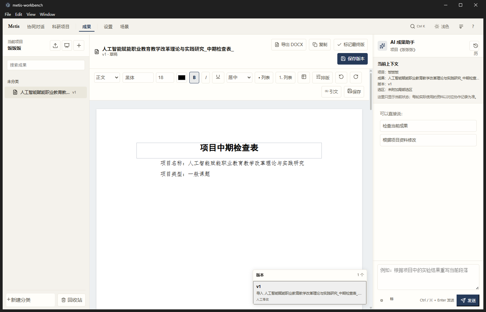
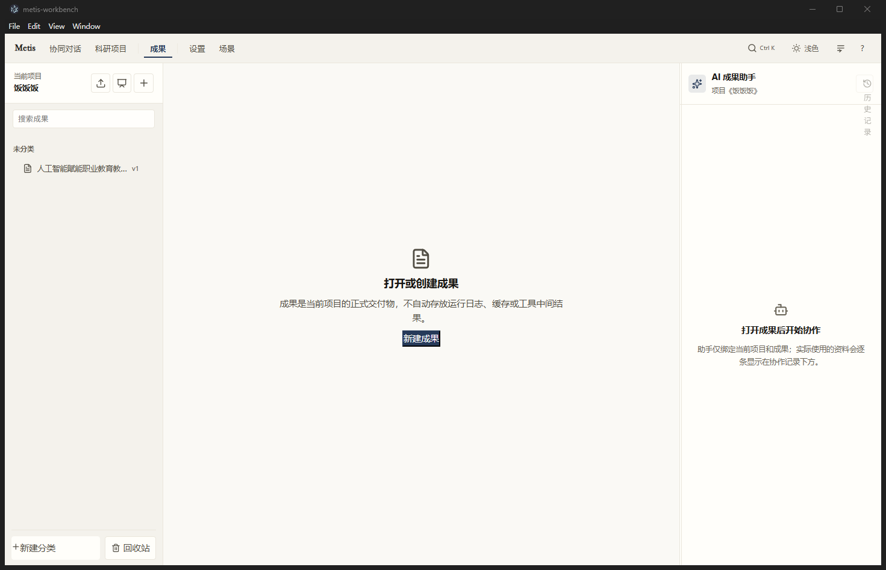
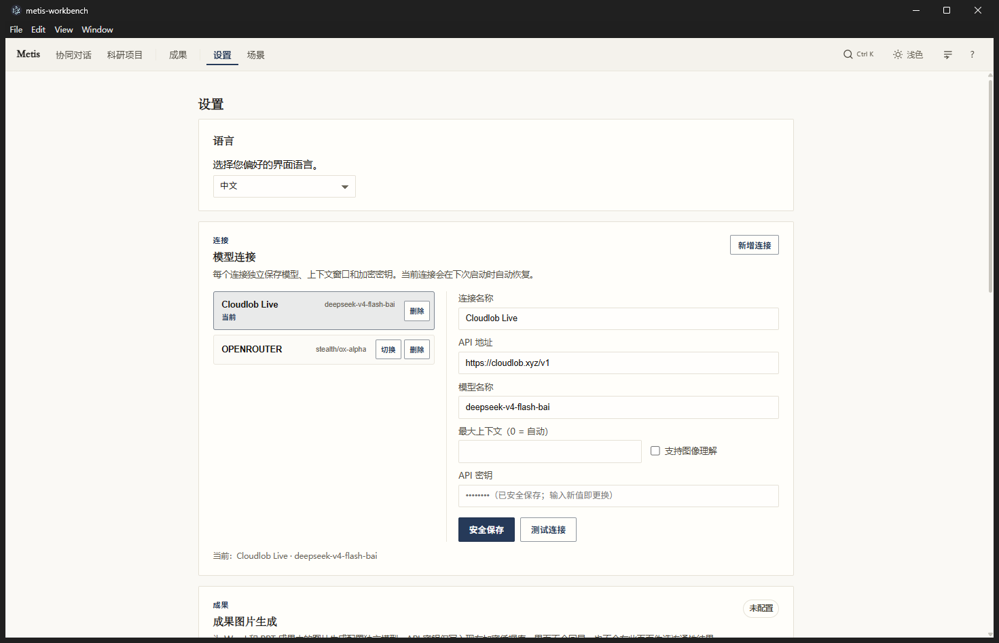

<div align="center">

# 📖 Metis in Social Science

# 本地优先的 AI 科研工作台

**可执行场景 × 运行时强制的研究诚信**

为社会科学与一切以证据为基础的写作而生。
把 AI 对话、文献管理、PDF 深度阅读、笔记、成果编辑与可复现的研究工作流装进同一个
桌面工作区——并让**诚信成为由确定性代码计算的系统属性，而不是模型的自觉**。

[⬇️ Windows 下载](https://github.com/TZUKWAN/metis-in-social-science/releases/latest) ·
[🌐 English](README.en.md) ·
[🧩 个人化指南](docs/PERSONALIZATION_GUIDE.md) ·
[📝 更新日志](docs/RELEASE_NOTES_v0.1.0-alpha.2.md) ·
[🐛 问题反馈](https://github.com/TZUKWAN/metis-in-social-science/issues)


</div>

---

## 📌 目录

- [Metis 是什么](#-metis-是什么)
- [两大设计承诺](#-两大设计承诺)
- [界面一览](#-界面一览)
- [核心功能详解](#-核心功能详解)
  - [① 科研项目工作台](#-科研项目工作台研究的家)
  - [② 可执行场景与 AI 编译器](#-可执行场景与-ai-编译器)
  - [③ 运行时强制的诚信管线](#-运行时强制的诚信管线)
  - [④ 智能体引擎](#-智能体引擎)
  - [⑤ 文献与深度阅读](#-文献与深度阅读)
  - [⑥ 成果工作台（Word / PPT）](#-成果工作台word--ppt)
  - [⑦ 个人化中心](#-个人化中心五类用户自有定义)
  - [⑧ 免费模型中心（实验性）](#-免费模型中心实验性)
  - [⑨ 更多能力](#-更多能力)
- [技术架构](#-技术架构)
- [安装](#-安装)
- [开发与构建](#-开发与构建)
- [常见问题](#-常见问题)
- [定位与边界](#-定位与边界诚实声明)
- [许可](#-许可)

---

## 🤔 Metis 是什么

### 一个真实的痛点

社会科学家的一天通常在这四类**互不连通**的工具之间来回切换：

| 活动 | 常用工具 | 问题 |
| --- | --- | --- |
| 来源管理 | Zotero 等文献管理器 | "项目"概念与写作脱节 |
| PDF 阅读与标注 | 阅读器 | 批注无法进入写作流 |
| 起草与修订 | Word / LaTeX | 出处随复制粘贴衰减 |
| 委托 AI | 通用聊天窗口 | 上下文断裂、无审计轨迹 |

碎片化的代价众所周知：**上下文在每个工具边界手工重建，声明的出处随每一次复制
粘贴而衰减，学术研究要求的审计轨迹根本无法穿越工具边界存活。**

### 一个尖锐的诚信问题

与此同时，LLM 辅助科研的诚信风险已从轶事变为可测量的事实——对 ChatGPT 生成
参考文献的审计发现了大量虚构条目与错误。更尖锐的是智能体场景：**一个声称做了
实验、或引用了任何工具从未产出的数字的智能体，生产的是具备论文形状的文本，
而非具备论文形状的证据。**

现有的缓解手段（RAG、归因评估、自检方法）大多部署在**模型侧**——提示、采样或
事后检查——而不是作为敌意或粗疏配置都无法绕过的**系统级保证**。

### Metis 的回答

> **Metis 把通常交给"信任"的两件事变成运行时计算的属性：**
> **① AI 被允许做什么（可执行场景）；② 产出是否值得学术信任（强制诚信）。**

Metis 是一个**本地优先**的桌面科研工作台：主存储是你自己机器上的 SQLite 数据库，
文件存于项目工作区，供应商 API 密钥存入操作系统级安全存储；只有当你主动发起
模型调用、学术 API 查询或邮件收取时，数据才会离开你的机器。网络访问是显式的、
用户发起的行为，而非后台假设。

---

## 🎯 两大设计承诺

### 1️⃣ 可执行场景（Executable Scenarios）

研究流程不是提示词集合，而是**版本化、依赖可解析的配置图**：

- 一个场景绑定：智能体、技能、MCP 服务、规则文档（Metis.md）、多步工作流、
  记忆策略、输出契约
- 会话启动时，个人化解析器解析场景及其**全部引用定义**——缺失、类型错误、
  被禁用或损坏的依赖会以机器可读原因**拒绝启动**（fail-closed）
- 解析结果冻结为**运行清单（Run Manifest）**：每个提示层携带 SHA-256 内容摘要，
  系统提示按优先级稳定排序合成，每层的来源与哈希在运行时可检视
- **正在运行的会话执行冻结清单**——编辑定义只产生未来修订（r+1），绝不悄然
  改变正在执行的任务。跑过的东西事后可重构，这与可复现研究管线中"配置冻结"
  是同一个直觉

场景编写由 LLM 辅助，但被**确定性阶段门与信任边界**约束：身份、修订与出处
字段钉定到持久化定义上，**模型无法重写自己的脚手架**（详见
[AI 编译器](#-可执行场景与-ai-编译器)）。

### 2️⃣ 运行时强制的研究诚信（Runtime-Enforced Integrity）

证据记账、数值声明溯源、参考文献交叉验证、密码学签名的引用收据、九维诚信
报告——全部由**确定性引擎代码**计算。这些机制位于**模型动作空间之外**：

| 你掌控的 | Metis 运行时掌控的 |
| --- | --- |
| 研究行为、角色、工作流、工具、记忆、输出、质量标准 | 执行快照、证据账本、来源状态、修订身份、出处、诚信报告 |
| 安装并绑定哪个技能或 MCP | 已安装代码如何注册、观测结果如何记账 |
| 何时引导、停止、编辑、归档、恢复 | 一次运行能否宣称"已验证、已修订、可发布" |

**提示词、场景文本或智能体输出，均无法将其关闭。**

---

## 📸 界面一览

> 以下截图全部来自真实运行中的系统。

### 🏠 科研项目工作台——研究项目的家

左侧项目库（新建/归档/删除），顶部 **AI 判定研究阶段**进度条（选题→概念图谱→…），
中间是绑定场景的 AI 对话，右侧同步呈现**任务清单 / 生成物 / 笔记**三个联动面板。
底部工具行：添加材料 · 学习技能 · 命名对话 · 选择模型 · 思考强度，悬停即见说明。



### 🎬 场景库与场景编辑器——可执行场景的编辑现场

场景页三栏布局：左栏场景库（分类/回收站/7 天恢复期），中栏分阶段定义表单
（01 基本信息 → 02 交付物 → 03 Workflow → 04 Scenario Metis.md → 05 输出计划），
右栏**场景配置助手**——用自然语言驱动 AI 编译器，右侧定义同步成型。



打开场景后的编辑态：每个阶段都是结构化表单，AI 与手动编辑作用于同一份草稿，
**保存后才成为可运行版本**：



### 📚 项目资料页——文献检索与语料管理

集成 **NCPSSD**（国家哲学社会科学文献中心，中文）与 **OpenAlex**（SCI/SSCI，英文）
双源检索，支持核心期刊（CSSCI/北大核心/CSCD · SCI/SSCI）过滤；方法库、研究笔记、
全文抽取、PDF 导入、音频转写、文献订阅一站式入口。



### 📝 成果工作台——应用内 Word 编辑与 AI 协作

成果是项目的正式交付物：应用内直接编辑 DOCX（字体/字号/对齐/列表/引用），
版本历史逐次可回退，右侧 **AI 成果助手**绑定当前项目与成果——全文修改或选区
局部修改，AI 修改自动存为新版本。



成果按项目分组管理，支持分类、搜索与回收站（误删可恢复）：



### ⚙️ 模型连接——供应商不可知

任意 OpenAI 兼容服务（名称 + API 地址 + 模型名 + 上下文窗口）即可作为后端；
多个连接相互独立、一键切换；API 密钥保存后即掩码显示并存入 **OS 级保险库**，
永不回显给渲染层。



---

## 🧩 核心功能详解

### ① 科研项目工作台（研究的家）

科研项目不是文件夹，而是**研究意图的容器**：研究问题、方法论、学科领域、
生命周期状态、交付物契约。

- **AI 判定研究阶段**：系统自动判定项目当前所处阶段（选题 → 概念图谱 → 文献
  → 分析 → 写作…），进度条直观呈现，点击直达
- **四页签一体**：聊天 / 任务看板 / 资料 / 研究成果，全部在同一项目上下文内，
  上下文不再穿越工具边界
- **右侧联动面板**：任务清单（提问即建任务）、生成物（运行产物自动归档）、
  笔记（草稿/引文/思路/待办，支持 Markdown）
- **场景绑定**：对话可绑定自定义场景（触发短语或手动选择），让 AI 按你定义的
  流程工作；未绑定则走默认科研助手
- **Full Access 就绪**：可随时引导或打断、真实性自动执行——运行行为始终在
  审批队列与硬安全边界之内
- **会话恢复**：重启后回到上次打开的页面和项目

### ② 可执行场景与 AI 编译器

#### 对话式构建，逐阶段验收

在场景配置助手里用自然语言描述需求（例如"帮我写一个 12000 字实证论文的场景，
先搭研究问题与证据框架"），AI 编译器**分五个阶段逐步构建**。每个阶段结束由
**确定性验收门**把关——不达标立即带着具体问题返回模型做阶段内修复，
而不是攒到运行末尾一次性爆雷：

| 阶段 | 内容 | 确定性验收门（节选） |
| --- | --- | --- |
| 1️⃣ 基础信息 | 名称 · 描述 · 能力 | 名称非空；描述 ≥ 20 字符；能力已设 |
| 2️⃣ 交付物 | 类型 · 篇幅 · 章节 | 类型在允许枚举内；篇幅为非空字符串；章节具稳定 id 与标题 |
| 3️⃣ 工作流 | 步骤 · 提示 · 标准 | 非空；每步具稳定 id、名称、专属提示与完成标准 |
| 4️⃣ 规则 | Metis.md 规则层 | 渲染出的规则文档不是空模板 |
| 5️⃣ 输出计划 | 格式 · 产物 · 质量 | 主交付物、支撑产物与质量标准齐备 |

#### 两段式驱动：先出大纲，逐条填写

工作流与章节采用**设计轮 + 填写轮**两段机制：

```
设计轮：AI 只产出大纲（步骤 id + 名称 + 依赖顺序），骨架立即逐个上屏
填写轮：主进程按大纲逐条驱动，每轮只填一个步骤的专属提示、完成标准、
        技能/MCP 绑定 —— 写完一个立即上屏一个
```

每个阶段**先联网检索资料、再整理分析、后写入**；右侧编辑器全程逐块成型；
构建结束自动保存，未保存离开会弹窗提醒。

#### 能力自动获取（有护栏的全自动）

工作流需要而本地尚未安装的技能/MCP，编译器会**自动搜索技能/MCP 市场 → 核验 →
安装 → 绑定到对应步骤**。护栏：

- 市场搜索是**只读**操作；安装仅接受 HTTPS 来源
- 技能安装走内容静态检查 + 来源记录；MCP 走托管安装器（manifest 下载 → 同源
  校验 → 摘要校验 → 统一托管启动）
- 单次构建安装数量有上限；每次安装都实时进入执行事件流，**可见、可审计、可卸载**
- 安装返回的定义 id 立即被绑定进步骤；市场没有合适候选时如实报告缺失，绝不编造 ID

#### 信任边界：模型无法重写自己的脚手架

编译器响应在严格边界解析——`id / kind / contractVersion / revision / provenance`
五个身份字段**一律钉定自持久化场景**，Zod 严格校验失败即整单拒绝并返回可行动的
问题清单。

#### 冻结运行清单与有界修复

场景通过验收后即可**启用**：个人化解析器解析全部依赖，产出冻结清单。运行期，
步级协调器执行工作流：**完成标准是强制的而非建议性的**——若编写了验收标准，
系统自动供给内部修复环（每步 ≤ 5 次迭代、失败重试 ≤ 2 次），弱输出在当前步骤
内修复而非虚假推进；四层控制路径暴露暂停与取消，并参与防止应用退出丢数据的
关闭准入协议。

#### 场景管理

分类与标签、**回收站（7 天恢复期，到期才永久清理）**、配置包导入导出
（含依赖图、凭据永不导出）、触发短语在对话中直接唤起场景。

### ③ 运行时强制的诚信管线

每次运行结束，你得到的不只是一段"看起来可信"的文本，而是一份**带判定的诚实
报告**。管线共四段，每一段都是模型动作空间之外的确定性引擎代码：

#### ① 证据账本（Evidence Ledger）

每次工具调用记录一条账目：工具名、调用 ID、会话、时间戳、**输入哈希、输出哈希**
（SHA-256）、状态与元数据——并**保留原始输入输出**。验证时重算哈希：事后篡改
存储结果可被检出。因为保留了原始工件，验证是有意义的而非空洞的。

#### ② 自欺守卫（Self-Deception Guard）

四项自动化检查审查智能体输出：

| 检查 | 逻辑 | 严重度规则 |
| --- | --- | --- |
| 🔢 数值声明溯源 | 输出中的每个数字必须能在工具结果文本中找到 | ≤2 处警告；>2 处严重 |
| 🧪 实验执行证明 | 声称做了实验 ⇒ 必须存在 execute_code 工具记录 | 任何违例即严重 |
| 📚 引用真实性 | 每个 DOI/arXiv 标识符必须通过元数据交叉验证 | 任何违例即严重 |
| ⚖️ 自洽性 | 输出内部不得存在矛盾标记 | 警告 |

#### ③ 引用真实性收据（Citation Truth Receipt）

引用验证**超越存在性检查**：

- DOI/arXiv 对照期望的标题、作者、年份做**交叉验证**（元数据不符即 INCONSISTENT）
- 被引来源计算规范化快照摘要（递归排序对象键后 SHA-256）
- 制品版本的收据 = 载荷 + **HMAC 签名**；密钥存 OS 级保险库
- 验证以**常数时间比较**重算签名，并执行存活期（TTL）检查

收据断言的是：*在该制品版本中，这些引用在该时刻指向这些已验证来源*——一份
**可审计、会过期**的凭证，而非不可验证的内联声明。

**三源交叉验证**：DOI 可按需在 Crossref + OpenAlex + Semantic Scholar 之间
三角验证（VERIFIED / INCONSISTENT / NOT_FOUND / PARTIAL）；文献卡片实时显示
撤稿状态（对接 OpenAlex 与 Crossref 的撤稿信号）。

#### ④ 九维诚信评分与判定带

| # | 维度 | 权重 |
| --- | --- | --- |
| 1 | 实验可复现性（已执行代码比率） | 0.11 |
| 2 | 数值声明溯源 | 0.13 |
| 3 | 引用真实性 | 0.13 |
| 4 | 工具调用审计完整性 | 0.09 |
| 5 | LLM 自洽性 | 0.09 |
| 6 | 被引文献撤稿筛查 | 0.13 |
| 7 | 声明出处覆盖率 | 0.07 |
| 8 | 声明对被引来源的忠实度 | 0.13 |
| 9 | 写作/格式质量（表、公式、图） | 0.12 |

综合分 S ∈ [0,100]，判定带：**S ≥ 80 通过（绿）· 60 ≤ S < 80 警告（黄）·
S < 60 失败（红）**。权重刻意上调溯源、真实性、撤稿与忠实度——最贴近学术诚信
的维度——相对压低格式分。声明级状态由**声明清单（Claim Manifest）**维护，逐声明
记录出处覆盖率与验证状态，馈入维度 7–8。

> ⚠️ **诚信分是决策支持而非证明**：绿色判定意味着"没有自动化检查失败"，
> 这是学术信任的必要而非充分条件。报告旨在引导人工复核，而非替代之。

#### ⑤ 导出闸门（fail-closed）

成果导出前过**真实性闸门**：正文引用必须解析到带新鲜真实性凭证的记录；数字/
数据论断必须有显式证据绑定；图表引用必须有对应实物或题注。**不过门就导不出去。**

#### ⑥ 证据锚点与主张图谱

- **证据锚点**：每条证据钉死到来源精确位置（PDF 页码 / 字符区间 / 音视频时间戳 /
  图片区域 / 表格行），附**引用文本快照**与来源版本哈希——来源更新后证据标记
  **STALE**，点击证据仍回到原始位置
- **主张图谱**：主张与证据的多对多关系（支持 / 矛盾 / 限定），带逐链接权重与
  置信度；自动计算主张状态（supported / contested / refuted / unsupported）；
  来源失效时受影响主张自动标记

#### ⑦ 不可关闭的运行时层

硬安全边界（见[智能体引擎](#-智能体引擎)）、能力权限、证据状态、修订与出处
身份——全部由确定性代码计算。**这一层不在提示词、场景文本或智能体输出的
可触及范围内。**

### ④ 智能体引擎

无框架的 TypeScript 回合制执行核心。**刻意不依赖任何智能体框架**——循环与供应商
之间没有中间层，这使信任边界保持可审计。

#### 回合制循环

每一回合：在预算画像内组装上下文包 → 调用 OpenAI 兼容供应商（SSE 流式）→
分发被请求的工具（参数校验、能力检查、遏制层）→ **证据记账** → 环路守卫检查 →
继续或终结。运行结束产出 `AgentRunResult` + 证据链 + 诚信判定。

#### 预算化上下文组装

上下文组装由**六档显式预算画像**治理（取自 `engine/context/BudgetManager.ts`）：

| 画像 | 上下文窗口 | 输出预留 | 填充阈值 | 每工具字符配额 | 截断上限 | 最大回合 |
| --- | --- | --- | --- | --- | --- | --- |
| micro_4k | 4,096 | 2,048 | 0.65 | 1,500 | 15 | 12 |
| micro_8k | 8,192 | 4,096 | 0.70 | 4,000 | 2,500 | 14 |
| micro_16k | 16,384 | 4,096 | 0.75 | 8,000 | 4,000 | 12 |
| small | 32,000 | 4,096 | 0.80 | 20,000 | 10,000 | 10 |
| balanced | 128,000 | 8,192 | 0.80 | 40,000 | 20,000 | 12 |
| deep | 200,000 | 16,384 | 0.80 | 60,000 | 30,000 | 20 |

**语义化溢出恢复**：传输错误做语义分类——溢出类失败触发历史激进重压缩并
**续跑同一步**，其他失败走常规重试；这一区分防止"静默上下文丢失"。

#### 环路守卫（三项）

1. **相同响应检测**：连续 3 轮输出签名相同即干预；**工具调用参数指纹并入签名**，
   避免把"每轮工具名相同但参数不同"的正常增量构建误判为死循环
2. **会话工具调用预算**：限制每会话累计工具调用数
3. **温度递升**：反复修复时有界上调采样温度，是对卡死采样的经典多样性扰动

默认值：12 回合、基础温度 0.2、每轮超时 120 秒、运行级超时 1,800 秒。

#### 硬安全边界（不可关闭）

引擎对 shell 执行实施**与任何配置无关**的硬边界：以破坏性系统变更为主要目的的
命令——递归强删、磁盘格式化、关机、编码单行命令、对版本控制历史的强制操作、
对系统路径的写入——经模式分析被拒绝，且该分析**刻意对抗引号混淆**（引号在边界
匹配前被剥离）。完全访问模式、场景文本、智能体输出都关不掉它。

#### 人在回路（HITL）与审批队列

审批规则可要求敏感工具先经确认；被拦工具进入**审批队列**，运行暂停直至人工
决策——批准、拒绝或修改后继续。

#### 多智能体编排

场景内可组合多个智能体：工作流步骤绑定不同智能体分工协作，主循环提供编排原语；
每步的运行记录持久化（步骤快照、执行键、产物引用、校验历史、工具调用摘要），
失控会话无法无界膨胀持久化记录（每个列表都有显式上界）。

### ⑤ 文献与深度阅读

- 📥 **PDF 导入**：拖拽/选择导入，解析元数据，关联到项目
- 📖 **深度阅读**：高亮 + 批注持久化、区域批注、AI 解读选中段落、批注一键导出
  文献笔记；来源文件更新后高亮自动标记 **STALE**
- 🔎 **双源检索**：NCPSSD（中文社科，国家哲学社会科学文献中心）+ OpenAlex
  （SCI/SSCI），核心期刊过滤，PDF 有开放获取链接时可直接下载
- 🏷️ **元数据自动补全**：DOI / arXiv ID 一键补全标题、作者、年份、摘要
  （不覆盖手动编辑）
- 📡 **文献订阅**：arXiv RSS 源自动刷新（超 6 小时），逐条 AI 一句话中文摘要
- 🔍 **全局搜索**：Ctrl+K 全文搜索论文正文（SQL 级查询，不遍历内存），一键直达
- 📤 **导出**：BibTeX / CSV / RIS 导入（Web of Science / Scopus / Zotero 格式）/
  自包含静态网页（可分享）/ Notion CSV
- 🧮 **对比矩阵**：多选论文逐项对比（方法/结论/创新点），支持 AI 分析

### ⑥ 成果工作台（Word / PPT）

成果是项目的**正式交付物**——不自动存放运行日志、缓存或工具中间结果。

- ✍️ **应用内编辑**：DOCX 段落样式、字体、字号、颜色、加粗/斜体/下划线、对齐、
  列表、引用、一键排版；PPT 网格画布（文本/形状/表格元素）
- 🕘 **版本历史 + 审核状态流**：草稿 → 待审 → 通过；每次修改（人工或 AI）存为
  新版本，逐版本可回退，版本面板标注来源（人工修改 / AI 修改 / 恢复）
- 🤖 **AI 成果协作**：助手仅绑定当前项目与成果；支持全文指令与**选区局部修改**
  （选中段落 → 指令 → AI 只改选区）；每轮实际使用的资料逐条显示在协作记录下方；
  未保存的本地编辑会阻止 AI 覆盖
- 📤 **导入导出**：DOCX / PPTX 双向；导出前过**真实性闸门**（见诚信管线）
- 🖼️ **媒体服务**：成果图片生成（可选配置）、SVG 安全处理

### ⑦ 个人化中心（五类用户自有定义）

开箱即带**五个空定义区**——Metis 不预置任何期刊模板、学位论文工作流、基金模板
或演示场景。**平台交付的是编辑器和运行时，而不是一堆对你研究方式的假设。**

| 定义类型 | 绑定内容（节选） |
| --- | --- |
| 🎬 场景 scenario | 名称、描述、能力、触发短语；智能体/技能/MCP/规则绑定；多步工作流；记忆范围；输出契约（格式、主交付物、支撑产物、质量标准） |
| 🤖 智能体 agent | 角色、系统指令、模型偏好、工具、技能、MCP 绑定、记忆策略、输出计划、回合与重试上限 |
| 🛠️ 技能 skill | Markdown 指令 + 可选打包脚本与文件；输入/输出模式字段（名称、类型、描述、必填） |
| 🔌 MCP 服务 | 安装来源、传输方式、命名密钥引用（**值永不回传渲染层**） |
| 📜 Metis.md 规则 | 全局 / 场景 / 项目三种作用域的规则文档，运行时按优先级合成 |

- **版本化**：每次保存产生不可变修订（r+1），更早修订随时恢复；内置定义受保护，
  编辑自动转为可编辑副本（fork 语义）
- **配置包**：按定义及其依赖图导入导出，**凭据永不导出**
- **三通道获取**：市场搜索（GitHub / SkillsMP / mcpworld / mcpmarket）、本地包、
  URL 直装；全部先验证再保存，安装结果不能伪造"已核验"状态
- **场景专属绑定**：技能/智能体可标记为仅本场景可见

### ⑧ 免费模型中心（实验性）

个体研究者的现实瓶颈是模型访问。Metis 内置一个**批式、限速**的免费模型获取
子系统：在用户显式配置下，于广泛部署的开源 "new-api" 系 OpenAI 兼容网关站上
自动化发现并注册。

**注册状态机（八步）**：探活（`GET /api/status`）→ 请求验证码 → **IMAP 轮询
配置邮箱**（同时扫描收件箱与垃圾邮件，解码 base64/quoted-printable MIME，提取
验证码）→ 携码注册（至多 3 次）→ 登录（后续调用携带会话头）→ 读取额度（换算
美元）→ 铸造 API 令牌（加密存入密钥保险库）→ 列出模型并入发现列表。

- 🚦 **定价表门**：模型被列为免费**当且仅当**定价表条目明确为零（按量：配额比
  为 0；按次：价格为 0）——**表外条目一律视为未知，仅逐模型实测，绝不视为免费**。
  设计规则：零余额账号不得把付费墙后的模型当作免费呈现
- 📊 调度器每批 5 站、站间 3–5 秒随机延迟，逐站进度流式推送界面
- ↩️ 零余额站点回退登录；人机验证拦截与邮件路径不可达如实标记为 **skipped**
  而非失败
- ⚠️ 该子系统是**管道而非科学贡献**，有效性完全依赖可能变更或消失的第三方服务；
  可选且明确标注实验性

### ⑨ 更多能力

- 🃏 **闪卡复习**：笔记/批注转闪卡，间隔重复（记住翻面、忘记重置）
- 📊 **阅读报告**：仪表盘一键生成本周阅读报告（主题脉络 + 各篇核心贡献 + 后续
  建议），可存为笔记
- ✨ **LaTeX AI 润色**：编辑器选中段落润色，保持 LaTeX 命令不变，预览后替换
- 🖼️ **LaTeX 预览**：应用内编译预览
- 🌗 **暗色主题** + 中英双语界面 + 🌍 全局语言切换
- ⌨️ **命令面板与快捷键**：Ctrl+K 全局搜索、Shift+/ 快捷键速查
- 🧪 **实验视图**：实验脚本注册、执行记录与产物关联（可复现性追踪：环境指纹 +
  多次运行方差分析）

---

## 🏗️ 技术架构

三层桌面架构，**契约先行的 IPC**——每个进出引擎的载荷都由严格模式描述
（禁止多余键的 Zod 风格契约、有界字符串长度、控制字符拒绝、枚举错误码）。
例如：步执行结果是判别联合——成功必须携带输出摘要与产物引用，失败必须携带
机器可读错误码；运行记录为每个列表设界（产物引用 ≤256、工具调用摘要 ≤104），
**失控会话无法无界膨胀持久化记录**。

```
┌──────────────────────────────────────────────────────────────┐
│ 渲染进程 — React 19 单页应用（沙箱化，禁用 Node 集成）            │
│ 对话 · 科研项目 · 文献库 · PDF 阅读 · 笔记 · 对比矩阵 · 实验      │
│ 任务看板 · 目标 · 成果工作台（Word/PPT）· 产物中心 · LaTeX 预览   │
│ 时间线 · 仪表盘 · 个人化中心 · 免费模型中心 · 设置（24 个顶层页面） │
├──────────────────────────────────────────────────────────────┤
│ 预加载桥 — contextIsolated 白名单 API（约 1,940 行）              │
│ 类型化 IPC 面 · 渲染层授权门 —— 渲染层与主进程唯一穿越点           │
├──────────────────────────────────────────────────────────────┤
│ Electron 主进程（Node.js）                                      │
│ ├─ 功能服务（约 90 个模块）                                      │
│ │   场景运行协调器 · 配置包/技能/MCP 安装器 · 成果 DOCX/PPTX 服务  │
│ │   科研运行时 · 文献检索 · 研究日志 · 免费模型发现与调度器        │
│ │   密钥保险库（OS 钥匙串）· 安全导出/下载 · 自动更新              │
│ └─ Metis 引擎（无框架 TypeScript 库）                            │
│     AgentLoop（回合制核心）· ContextEngine + BudgetManager       │
│     工具注册/分发/呈现 · 文本工具协议（含 DSML 解析）              │
│     EvidenceLedger · IntegrityReporter · SelfDeceptionGuard     │
│     CitationTruth · 个人化解析器 · 场景编译器 + 阶段门            │
│     工作流引擎 · 目标引擎 · 多智能体编排器 · MCP 管理器（stdio）   │
├──────────────────────────────────────────────────────────────┤
│ 持久化：本地 SQLite（better-sqlite3）· OS 级密钥保险库 ·           │
│ 项目工作区文件（PDF · Metis.md · 导出物）                         │
└──────────────────────────────────────────────────────────────┘
```

**设计原则**：① 本地优先、显式出口；② 零预设科研假设；③ **信任边界处的确定性**
——凡 LLM 产出结构化内容，确定性验证器拥有身份、版本与验收权；④ **诚信靠计算
而非声明**；⑤ 真实路径优于 mock——测试套件演练 Electron 路径，而非只测 DOM mock。

**实现度量**（发布源码树实测）：

| 度量 | 数值 |
| --- | --- |
| 渲染层顶层页面 | 24 |
| 引擎模块目录 | 38 |
| 主进程功能服务模块 | ≈90 |
| 主进程入口 main.ts | 9,911 行 |
| 预加载桥 preload.ts | 1,940 行 |
| TypeScript/TSX 源文件（src + engine + electron） | 635（≈8.3 MB） |
| 测试文件（全部套件） | 409 |
| 记录的引擎套件运行 | 154 文件 / 1,843 测试，全绿 |
| 记录的前端套件运行 | 1,141 测试，全绿 |
| 类型检查工程 | 4 个，零错误 |

---

## 📦 安装

### Windows 安装包（推荐）

1. 前往 [**Releases**](https://github.com/TZUKWAN/metis-in-social-science/releases/latest)
   下载 `Metis-Research-Workbench-Setup-<版本>-x64.exe`
2. 双击安装，支持自定义安装目录
3. 首次运行如遇 Windows SmartScreen 提示（安装包未做代码签名），点击
   **「更多信息 → 仍要运行」**

### 首次启动四步

1. ⚙️ **配置模型连接**：设置 → 模型连接 → 新增连接（名称 + API 地址 + 模型名 +
   API 密钥）。任意 OpenAI 兼容服务均可；密钥保存后即掩码并存入 OS 保险库，
   永不回显。多个连接可随时切换
2. 📁 **创建研究项目**：科研项目 → 新建项目
3. 📚 **导入文献或开始对话**：资料页检索 NCPSSD/OpenAlex 并入库，或直接在聊天页
   提出研究问题
4. 🎬 **（可选）构建你的第一个研究场景**：场景页 → 新建 → 在右侧配置助手用自然
   语言描述需求，AI 编译器分五阶段自动构建

---

## 🛠️ 开发与构建

```bash
# 克隆
git clone https://github.com/TZUKWAN/metis-in-social-science.git
cd metis-in-social-science

# 安装依赖
npm install

# 开发模式（Vite 热更新 + Electron）
npm run dev:electron

# 生产构建（typecheck ×4 + 主进程编译 + 渲染端打包 + 原生模块重编译）
npm run build

# 运行测试（全部套件）
npm test

# 仅前端套件（快速）
npm run test:fast

# 类型检查（app / engine / node / electron 四工程）
npm run typecheck

# 代码规范
npm run lint

# 打包 Windows 安装程序（NSIS，输出到 release/）
npm run rebuild:electron
npx electron-builder --win nsis
```

> 💡 **原生模块须知**：`better-sqlite3` 是原生模块，开发（Node ABI）与打包
> （Electron ABI）所需的二进制不同——分别用 `npm run rebuild:node` 与
> `npm run rebuild:electron` 切换。遇到 `NODE_MODULE_VERSION` 不匹配报错即此因。

**技术栈**：Electron 41 · React 19 · TypeScript（strict）· Vite ·
better-sqlite3 · pdfjs-dist · Zod（全链路运行时契约）· Vitest · electron-builder

---

## ❓ 常见问题

<details>
<summary><b>我的研究数据存在哪里？会上传吗？</b></summary>

本地 SQLite 数据库 + 项目工作区文件，全部在你自己的机器上。只有当你主动发起
模型调用、学术 API 查询、邮件收取或市场搜索时，相应内容才会离开机器——网络
访问是显式的、用户发起的行为。
</details>

<details>
<summary><b>API 密钥安全吗？</b></summary>

密钥由 Electron 主进程处理，存入**操作系统级安全存储**（OS 钥匙串），保存后
掩码显示、永不回显给渲染层，绝不写进个人化定义、导出 bundle 或任何设置响应。
</details>

<details>
<summary><b>支持哪些模型？</b></summary>

任何 OpenAI 兼容 API（`/v1/chat/completions` + SSE 流式）：官方 API、各类中转
网关、本地推理服务均可。模型不可知——带上你自己的模型。
</details>

<details>
<summary><b>诚信分 80 分以上就代表内容可信吗？</b></summary>

不。绿色判定意味着"没有自动化检查失败"，这是学术信任的**必要而非充分条件**。
数值溯源基于文本匹配（改写数字可绕过），安全边界基于模式。诚信报告的定位是
**引导人工复核**，而非替代人工复核。
</details>

<details>
<summary><b>支持 macOS / Linux 吗？</b></summary>

当前仅发布 Windows x64 安装包。技术栈本身跨平台，但 macOS/Linux 打包未经
发布验证。
</details>

<details>
<summary><b>免费模型中心安全吗？</b></summary>

它只在 you 显式配置邮箱与站点后工作；铸出的密钥加密存入 OS 保险库；定价表门
保证零余额账号不会把付费模型当作免费呈现。但它依赖第三方服务，属**可选的实验性
功能**，请自行评估第三方站点的可信度。
</details>

---

## 🗺️ 定位与边界（诚实声明）

**与同类工具的关系（定性对照，非基准）**：

| 能力 | Metis | 文献管理器（Zotero 等） | 通用笔记+LLM | 自主"AI 科学家" | 智能体实验室框架 |
| --- | :-: | :-: | :-: | :-: | :-: |
| 本地优先主存储 | ● | ● | ● | ◐ | ◐ |
| 项目域语料 + PDF 阅读 | ● | ◐ | ◐ | ✗ | ✗ |
| 可执行多步场景 | ● | ◐ | ◐ | ● | ● |
| 冻结运行清单（编辑隔离） | ● | ✗ | ✗ | ✗ | ✗ |
| 运行时证据账本 + 诚信分 | ● | ✗ | ✗ | ✗ | ✗ |
| 签名过期引用收据 | ● | ✗ | ✗ | ✗ | ✗ |
| 应用内交付物编辑（DOCX/PPTX） | ● | ✗ | ◐ | ✗ | ✗ |
| HITL 审批 + 硬安全边界 | ● | ✗ | ✗ | ✗ | ✗ |
| 自主论文生成 | ◐ | ✗ | ✗ | ● | ● |

● 原生设计 ◐ 部分/经插件 ✗ 缺失。标记应读作"为此设计"，而非基准化的优越性。

三点观察：**文献管理器**长于目录策展，并非为执行研究流程或计算证据诚信而设计
——Metis 是其补充而非替代；**自主科研系统**证明端到端生成可行，却把诚信当作
事后补丁——Metis 把诚信基底放在首位，并把自主性约束在有系统上限的修复环、
暂停/取消与审批队列之内；**通用智能体框架**提供编排原语，但缺少平台内的学术
特化保证（引用收据、撤稿筛查、声明清单）。

**已知局限**：

1. **无基准评估**——报告的是实现度量与记录在案的测试运行，不是任务基准分数
   （GAIA / SWE-bench / CORE-Bench 等度量的构念与学术诚信不同，适配是未来工作）
2. **边界处护栏是启发式的**——数值溯源基于文本匹配（改写数字可绕过）；硬安全
   边界基于模式（新型破坏性语法需更新黑名单）；纵深防御（分发器校验、能力检查、
   OS 沙箱）可缓解但不能根除
3. **诚信分是决策支持而非证明**（见常见问题）
4. **第三方依赖**——免费模型子系统依赖行为与自动化注册合法性各异的外部服务
5. **单平台发布**——当前仅 Windows x64
6. **定性比较**——上表反映文档化能力而非实测性能

---

## 🤝 贡献

欢迎 Issue 与 PR：[贡献指南](CONTRIBUTING.md) ·
[行为准则](CODE_OF_CONDUCT.md) · [安全策略](SECURITY.md)

## 📄 许可

本项目基于 [MIT License](LICENSE) 开源。

---

<div align="center">

**Metis —— 你的研究，你的规则，你的本地机器。**
**每个产出旁边，都有一份诚实报告：系统做了什么，其中多少可验证。**

</div>
