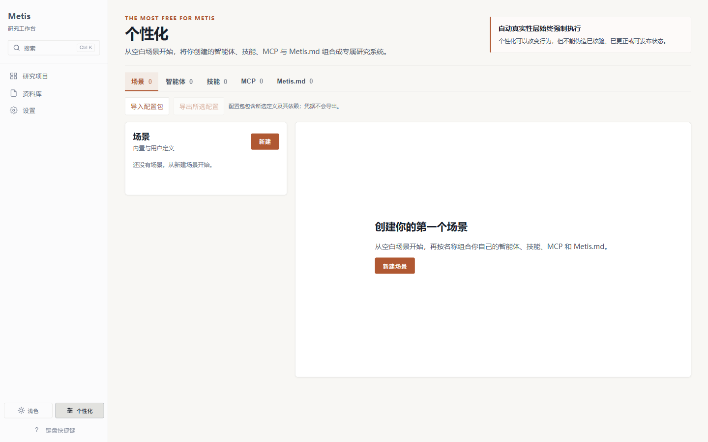
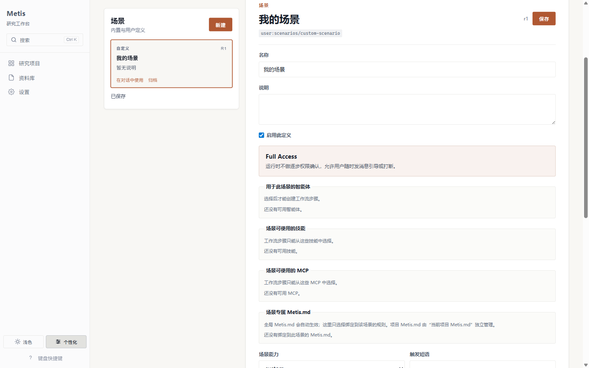
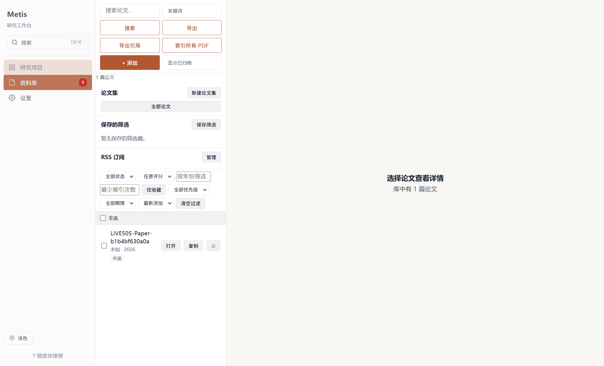
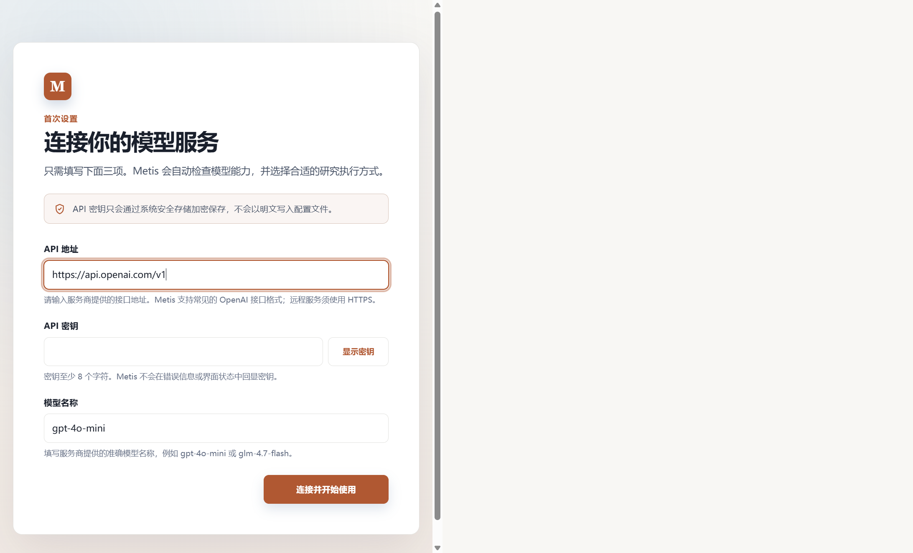
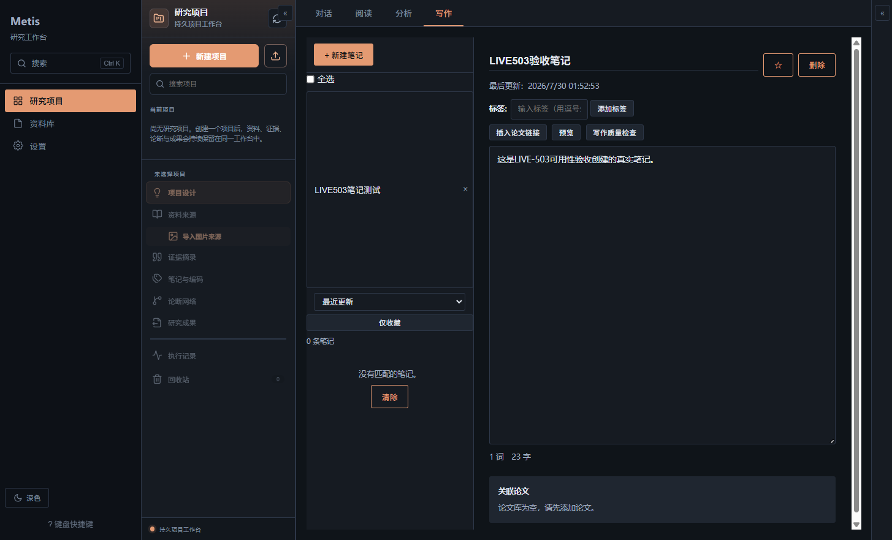

<div align="center">

# Metis in Social Science

# 本地优先的 AI 科研工作台

为人文、社会科学与一切以证据为基础的研究写作而生

把 AI 对话、文献管理、PDF 阅读、笔记、Office 文档、可复现的研究工作流，
以及完全由你定义的智能体，整合进同一个桌面工作区。

[Windows 下载](https://github.com/TZUKWAN/metis-in-social-science/releases/latest) ·
[英文文档 / English README](README.en.md) ·
[个人化指南](docs/PERSONALIZATION_GUIDE.md) ·
[更新日志](docs/RELEASE_NOTES_v0.1.0-alpha.2.md) ·
[问题反馈](https://github.com/TZUKWAN/metis-in-social-science/issues)

</div>

---

## Metis 是什么

Metis 是一款**本地优先（local-first）**的桌面 AI 科研工作台。它不是"一个聊天框加几个
学术提示词"，而是一个完整的研究环境——把**项目、来源、会话、产物、规则、工具连接、
执行状态**都当作一等对象来管理。

一次安装，一台电脑，从问题形成到证据收集、分析、起草、修订、导出，**全程无需在互不相连
的工具之间反复搬运上下文**。你的研究数据与个人化配置默认保存在本地，由你完全掌控。

这一版的核心理念只有一句话：

> Metis 不替你决定"你是什么类型的研究者"。它提供一套系统，让你定义属于自己的研究场景、
> 智能体、技能、MCP 服务、工作流、记忆策略与输出契约。

---

## 为什么选择 Metis

### 零预设，完全自定义

开箱即带五个空的定义区：场景、智能体、技能、MCP、Metis.md 规则。Metis 不预置任何期刊、
学位论文、基金、专著、政策或演示工作流。你决定哪些概念该存在、该怎么运作。

Metis 交付的是**编辑器和运行时**，而不是一堆对你研究方式的假设。

### 本地优先，隐私可控

项目、会话、笔记、产物、个人化定义全部保存在本地 SQLite 与磁盘。只有当你主动使用某项
功能时，内容才会离开你的机器——比如你主动向配置好的模型服务商发送一个问题。

API 密钥由 Electron 主进程处理，存入操作系统的安全存储，**绝不**写进个人化定义、导出
的 bundle，或渲染进程可读取的设置响应里。

### 可执行的研究场景，不是提示词画廊

一个 Metis 场景不是一段提示词，而是一张**带版本依赖的可执行配置图**。运行中的会话拿到
的是冻结快照（frozen manifest），编辑定义只会影响未来的运行，不会悄悄改变正在执行的
任务。

### 研究诚信内建，无法被提示词绕过

证据状态、来源身份、修订状态、出处、可发布性——这些都由运行时计算，而非由可编辑的场景
或智能体文本声明。这些控制始终保持自动，是系统层的一部分，**不是提示词能关闭的开关**。

| 你掌控的 | Metis 运行时掌控的 |
| --- | --- |
| 研究行为、角色、工作流、工具、记忆、输出、质量标准 | 执行快照、证据信封、来源状态、修订状态、出处、诚信报告 |
| 安装并绑定哪个技能或 MCP | 已安装代码如何注册、观测结果如何记录 |
| 何时引导、停止、编辑、归档、恢复 | 一次运行结果能否宣称"已验证/已修正/可发布" |

### 一站式工作区，端到端

对话、文献库、PDF 阅读、笔记、图谱、时间线、对比视图、实验视图、LaTeX 预览、产物管理、
Office 文档、导出——全部在同一个项目上下文里。

---

## 核心功能一览

### 个人化中心

个人化中心从空状态起步。每一个场景都由你创建或安装，每一个依赖都按名可见。五个用户自有
的定义区：**场景、智能体、技能、MCP、Metis.md**。



### 场景编辑器

每个场景可以组合智能体、技能、MCP 服务、Metis.md 规则、多步工作流、记忆策略、输出格式、
主交付物、支撑产物与质量标准。



### 文献库

PDF、书目记录、集合、标签、阅读状态、研究产物，始终与同一个项目和会话上下文保持关联。



### 首屏模型配置

任何 OpenAI 兼容服务都可以作为后端。Metis 不锁定任何单一供应商。



### 暗色主题笔记

笔记是研究产物的温床：草稿、引文、思路、待办、卡片——全部支持 Markdown。



---

## Metis 能做什么

### 把 AI 模型当作研究伙伴

不是"问答"，而是可执行的研究场景。每个场景由你定义：输入什么、分析什么、输出什么、
怎样算完成。

### 把研究组织成项目，而不是零散消息

项目不是文件夹，而是研究意图的容器：研究问题、方法论、学科领域、生命周期状态、交付物契约。

### 构建并审视文献库

导入 PDF，解析元数据，建立引用关系图，追踪阅读进度，生成综述草稿。

### 在同一工作区阅读、标注、分析、写作

阅读 PDF 时高亮、批注、AI 解读选中文本；写作时调用笔记与文献；分析时对比多篇论文。

---

## 新功能（Alpha 2）

### 成果管理台

项目产出的成果（文稿、图表、报告）按项目分组管理，支持版本历史、审核状态流转
（草稿→待审→通过）、元素级操作。

### Office 文档工作台（所见即所得）

原生编辑 Word/PPT/Excel，预览里直接点选、双击改字、拖拽 PPT 元素——不需要回到聊天框。
排版工具栏支持标题级别、中英文字体、字号、颜色、对齐、行距、缩进、列表。
PPT 元素自动避让不重叠。AI 自然语言编辑："加一个 3 行表格"→ 实时预览刷新。

### PDF 深度阅读

高亮+批注持久化、区域批注、AI 解读选中段落、批注一键导出文献笔记、STALE 检测
（源内容更新后标记过期高亮）。

### 全文搜索

Ctrl+K 全局搜索支持论文正文（SQL 级查询，不遍历内存），一键直达论文。

### 会话恢复

重启后回到上次打开的页面和项目，不打断思路。

### AI 文献综述与对比

多选论文 → 生成带引用的综述草稿（主题聚类/方法演进/共识与分歧/研究空白）。
对比矩阵支持 AI 分析（方法/结论/创新点逐项对比）。

### 阅读报告

仪表盘一键生成本周阅读报告（主题脉络 + 各篇核心贡献 + 后续建议），可存为笔记。

### 闪卡复习

笔记/批注转闪卡，间隔重复复习（记住翻倍/忘记重置）。

### LaTeX AI 润色

编辑器选中段落 → AI 润色（保持 LaTeX 命令不变）→ 预览替换。

### 元数据自动补全

DOI/arXiv ID 一键补全标题/作者/年份/摘要，不覆盖手动编辑。

### RSS AI 摘要

arXiv 订阅源打开自动刷新（超 6 小时），逐条 AI 一句话中文摘要。

### 导出增强

文献库导出 BibTeX / CSV / 静态网页（自包含 HTML，可分享）/ Notion CSV。
支持 RIS 导入（Web of Science / Scopus / Zotero 导出格式）。

---

## 技术架构

- **Electron 41 + React 19 + TypeScript + Vite**：桌面端跨平台
- **better-sqlite3**：本地 SQLite 持久化（项目/文献/笔记/成果/记忆）
- **OpenAI 兼容 Provider**：任何兼容 API 均可作为模型后端
- **OfficeCli**（Apache-2.0）：原生 Office 文档编辑（.docx/.pptx/.xlsx）
- **pdfjs-dist**：PDF 渲染与文本提取
- **Zod**：全链路运行时契约校验
- **Vitest**：4389+ 单元/集成/E2E 测试

---

## 安装

### Windows 版本

从 [Releases](https://github.com/TZUKWAN/metis-in-social-science/releases/latest) 下载
最新安装包，双击安装即可。

### 开发者

```bash
# 克隆
git clone https://github.com/TZUKWAN/metis-in-social-science.git
cd metis-in-social-science

# 安装依赖
npm install

# 开发模式（热更新）
npm run dev

# 生产构建
npm run build

# 运行测试
npm test
```

---

## 使用指南

### 首次启动

1. 配置模型服务商（任何 OpenAI 兼容 API：base URL + API key + 模型名）
2. 创建你的第一个研究项目
3. 导入文献或开始对话

### 核心工作流

- **研究场景**：个人化中心 → 新建场景 → 组合智能体/技能/工作流 → 聊天触发
- **文献阅读**：文献库 → 导入 PDF → 阅读/高亮/批注/AI 解读 → 导出笔记
- **成果管理**：分析模式 → 成果页 → 项目成果总览 → 版本/审核/导出
- **Office 编辑**：写作模式 → Office 文档 → 新建 Word/PPT/Excel → 所见即所得编辑

---

## 社区

- **问题反馈**：[GitHub Issues](https://github.com/TZUKWAN/metis-in-social-science/issues)
- **讨论区**：[GitHub Discussions](https://github.com/TZUKWAN/metis-in-social-science/discussions)

---

## 许可证

Apache License 2.0

---

<div align="center">

**Metis — 你的研究，你的规则，你的本地机器。**

</div>
